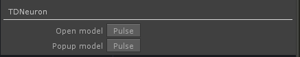
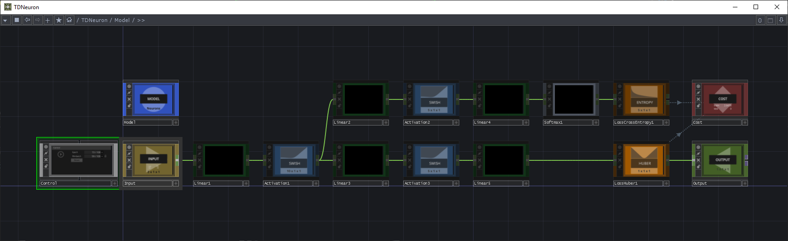

## Creating a model

The TDNeuron Base COMP has two important pulse parameters:

1. Open model
2. Pop up model

### The model popup
---

Opens a floating window with your model, which is handy for editing.

### Open model
---

Takes you to your model and pane editor. In there you can construct your deep learning model.

