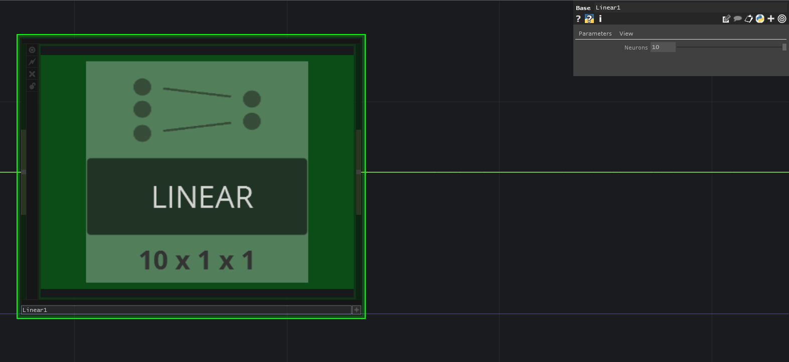
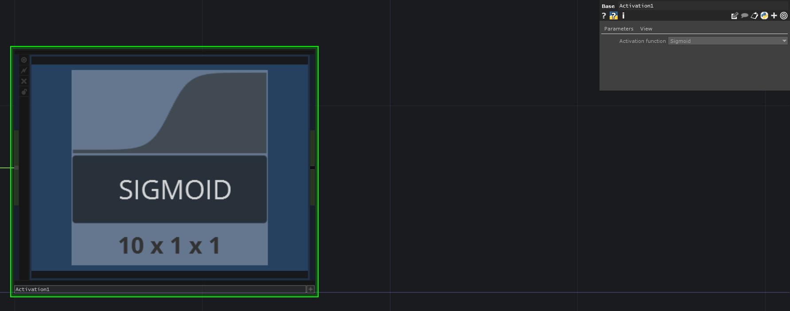
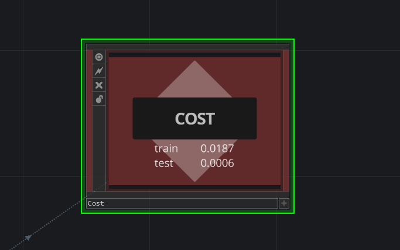
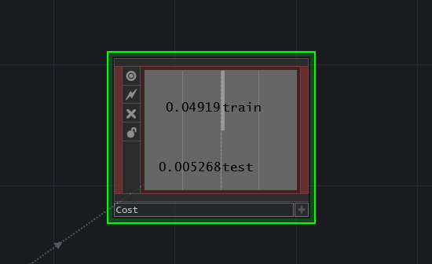
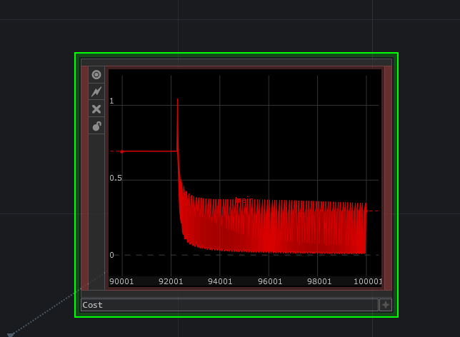

## Training

### 1
---
To train a model you need to create a network. To do so you use the pane on top of the editor, which contains all the available deep learning nodes. The type of nodes you need to use depend on your input data and the type of problem you are trying to solve. To start with, let us solve a classification problem. 

Drag and drop the following nodes to see how this works:

### 2
---
Each node hast its own possible custom parameters. For instance some important paramters in this task are to set the amount of neurons for the linear layer:

### 3
---
And to set the type of activation function that we want to use, in the custom paramters of the activation node:

### 4
---
To train our model using this input data, we need the network on the image below (please refer to "Introduction to Machine Learning" to understand why). The minimal settings for this network we have chosen are:

- **Linear1**: 2 neurons
- **Activation1**: Leaky RELU
- **Linear2**: 1 neuron
- **Activation2**: Sigmoid
- **Loss**: Cross entropy

Notice that we need to connect to the output and that our Cost module infers its input from the Loss module automatically.

### 5
---
The final step is to go to our "Control" COMP, build our project and start training. You do so by clicking on "Reset and Build" and then pressing the "play" button.

### 6
---
See what happens in the "Cost" node. You can observe your data on the TDNeuron default viewer, or you can press the Viewer flag to Swith to "Data view", as you can see in the images below. If your cost approaches zero, it means that your model is learning. Try experimenting by tweaking things around an checking what works best and what does not. 

