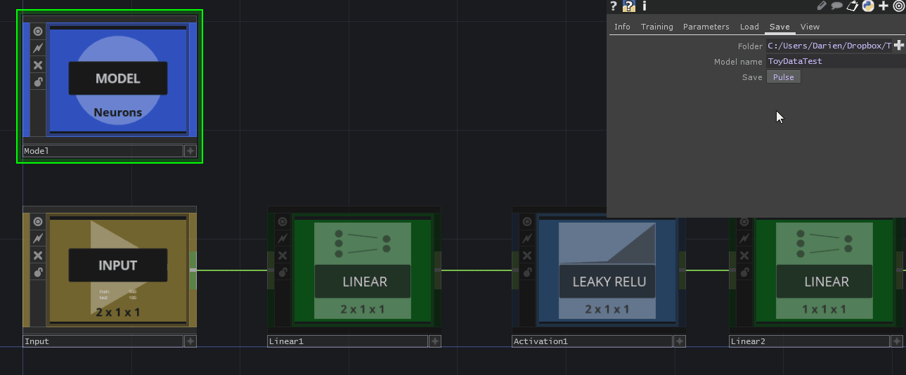

### Saving and loading models

## 1
---

It is possible to save models you have created within TDNeuron. All you need to do is going to the "Model" node and click on the "Save tab. Here you will see options for saving, including a target directory and a model name. Once you have set these, simply click on "Save". If succesful, a prompt will appear:

## 2
---

To load a model, go to the "Load" page and select the targetted JSON file, the model will be loaded and built for you, ready to run:

