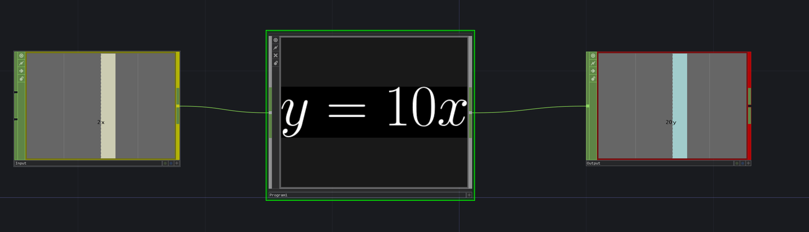
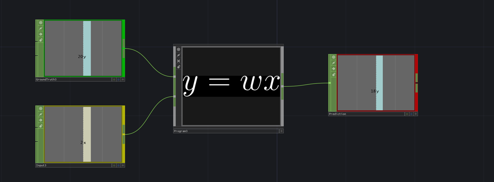

While programming, we often have the task of processing and input `x` to output a value `y`.

Imagine that we are requested to build a program that takes any number as input and multiplies it by 10. Here, expressed in an equation: 

```math
y = 10x
```
Our job consists on designing a program with the specified feature that should always produce a correct result. The task in this example is trivial and it is rather obvious what we have to do. 

Let us solve this simple example by building a component called "Program1".  



As we will see, it is not always possible to come up with a simple heuristic that produces a correct result.

Let us imagine that we have the task of creating a program that takes an image `x`, with resolution of 1280x720 pixels and detects whether the image is a banana or not. 

We need to understand what our input `x` is in this case, so we ask ourselves: how many "input features" do we have?

In the previous example we had a single feature, since our `x` was a single number. Now we are dealing with a whole image, so the real question is: how many numbers do we have?

Since an image is a collection of pixel values distributed across 3 channels (RGB), we can infer that we have with the given resolution: 

```
1280 x 720 x 3 = 2764800 features
```

That is an awful lot more than in the previous example. Our next question is: what should be our output?

Our output should be just a single value, since all we want to know is whether an image is a banana (True) or if it is not (False). What can we do to achieve that?

We observe in this example one possible idea: compute the average of a known image of a banana (our "**ground truth**") and compare it to the average of the input image `x`. If this differs, it means that we are not dealing with a banana. 


At first glance this works, but once we start to alter our input features slightly, the program will fail. 

Try to adjust the transform controls in the "Program2" node. For instance, this algorithm is not smart enough to understand that when the image is scaled up just slightly, we are still dealing with the same object. 

Transformation and rotation for the most part work, since the average remains constant, but as soon as some pixel values are different, the algorithm will fail. 

Since we are dealing with millions of numbers to determine if the image is a banana or not, it becomes virtually impossible to write a program by hand that covers all the possible rules. We clearly need a better approach. 

At first glance this works, but once we start to alter our input features slightly, the program will fail. 

Try to adjust the transform controls in the "Program2" node. For instance, this algorithm is not smart enough to understand that when the image is scaled up just slightly, we are still dealing with the same object. 

Transformation and rotation for the most part work, since the average remains constant, but as soon as some pixel values are different, the algorithm will fail. 

Since we are dealing with millions of numbers to determine if the image is a banana or not, it becomes virtually impossible to write a program by hand that covers all the possible rules. We clearly need a better approach. 



To solve this complex problem, we can use machine learning. Instead of trying to program a fixed equation (like in our first example), we are going to create an algorithm that can autonomously adapt a mapping `w` from the set of given `x` features to our known desired **ground truth** `(y)`.

Let's take a step back and see how this works with an easier example.

When we approach a problem using machine learning, instead of writing the program ourselves we **train** an algorithm with many examples and a  corresponding ground truth. 

The algorithm uses internal parameters (**weights**) to predict a certain output. Subsequently it calculates an error (**loss**) based on the given ground truth and uses this to tweak its weights automatically.

