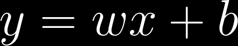
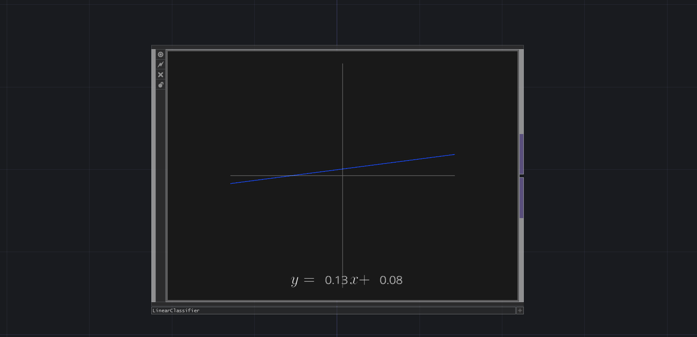
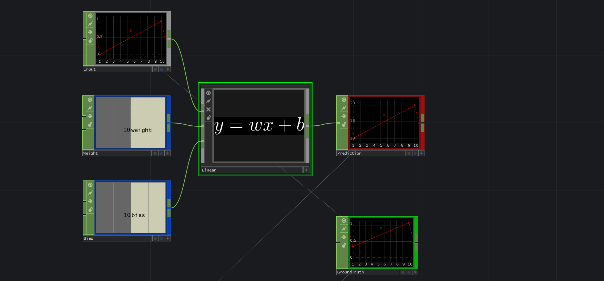
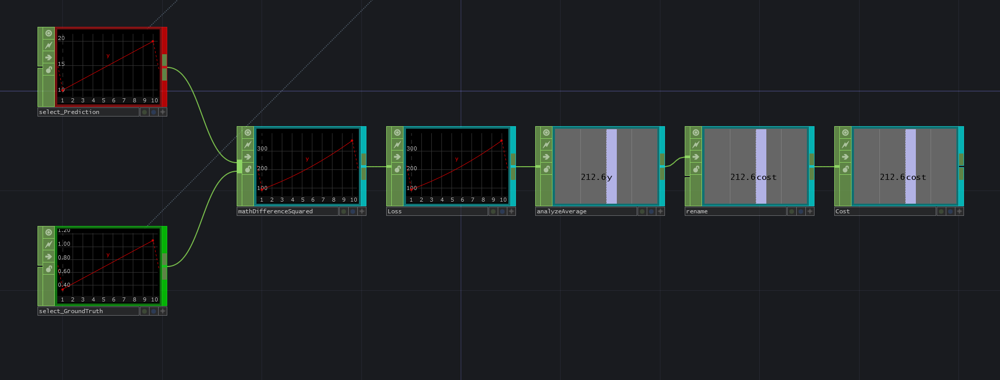
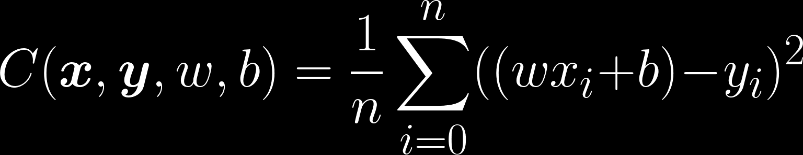
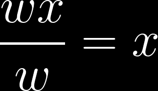

You might have noticed that the equation `y = wx ` that we just saw, can also be interpreted as a line through the origin.

To be able to express any line with such equation, we need to add an offset `b` (**bias**) to the formula.

y = Output 	(height)
x = Input 	(horizontal position)
w = Weight 	(line steepness)
b = Bias 	(line origin offset)

To visualize this, look at the following tool.  It is possible to adjust the `w` and `b` parameters to move the blue line.

If you press 'Show data' some samples will appear. Notice that such a line could be used to separate the red and yellow groups. 

The goal is to find the right `w` and `b` values that can fit the data in these two clear categories.

Let us now see how to use this line equation as a **model** that could fit some data. 

In the following example we supply our program 10 input data samples. The 'Linear' node is called so because it implements the line equation.

Try adjusting the Weight and Bias constant CHOPs to match the 'prediction' node with the 'GroundTruth' node.

You may have seen that matching the prediction to the ground truth by eye is not the best strategy, since it is hard to swiftly find the right values. 

To make this more effective, we need a way to calculate how close or how far are we are from the ground truth, while changing parameters.

The error or '**loss**' of a sample is the value that can reveal this to us. When we have many samples, we need to get the added mean of all sample-losses. This is called the '**cost**'. 

A high cost means that we are doing poorly, because we are far from the ground truth. A low cost means we are doing well, because we are close to the ground truth. The ultimate goal is to have a a cost as close to zero as possible.

We also take into account that this 'loss' values should always be positive, to make sure that samples do not cancel each other out when later on we use this information to update our parameters automatically.

One possible way to achieve this is to calculate the **Mean Squared Error (MSE)**. This consists of squaring the difference between the ground truth and the prediction values, taking the mean (average) of those differences, and finally summing them up. 

The following equation expresses the MSE calculation.

It is very valuable and important to get familiar with  mathematical notation and understand how to read and interpret it. 

Do not get scared by the following equations! You will soon enough see that they are easier to understand than they look. 

If we decompose its components, this equation says:

* **`C(x,y,w,b)`**: Cost function
	- Called "mean squared error" (MSE).  
	- It requires 4 parameters (x, y, w, b)
	- Calculates the  error between the prediction and ground truth.	
* **`x`** : input samples
* **`y`** : ground truth (same amount of samples as input)
* **`w`** : weights (to be trained)
* **`n`** : number of samples
* **`i`** : sample iteration
* **`wx+b`** : multiply weights with input and add bias (prediction)
* **`wx+b-y`** : Difference between ground truth and prediction
* **`^2`** : Squared, so we get positive values and so that bigger errors get more penalty.

But how do find the right direction? 

Consider the following simplification of an hypothetical cost function:

If we decompose this equation it says:

* **`C(x, w)`** : Cost function 'C'.  
	- Requires 2 parameters (x,w)
	- Cost is calculated by multiplying x by w
* **`x`** : input samples
* **`w`** : weights (to be trained)

We can immediately see in this scenario that if we increase `w`, the output of the function will also increase. To be exact, the output will be `x` times the change in `w`.

This means that we can simply look at the input `x` to see in which direction (positive or negative) we would need to update `w`, so the function gets closer to 0. 

In this silly equation, the solution would be `w=0`, since ``w * x`` will render that value.

Keep in mind that our ultimate goal is to make the output of the cost function as small as possible. We do this by adjusting `w` and `b` a little bit in the right direction, on every iteration of the algorithm.

Notice that `x` and `y` are a fixed set of values and will never change, since they represent the input training data and the output ground truth. They are hence immutable. 

Coming back to the **MSE** case, we would need to calculate a more complex derivative, since we have a more complicated function. This derivative will tell us in what direction we need to move to reduce the cost of our model.

See 'Appendix 1: calculus' for more detailed information on how to find derivatives.

