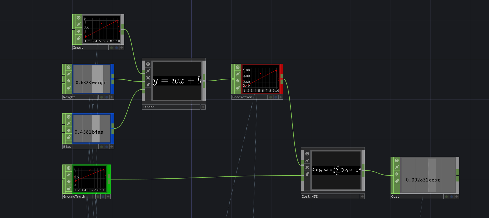
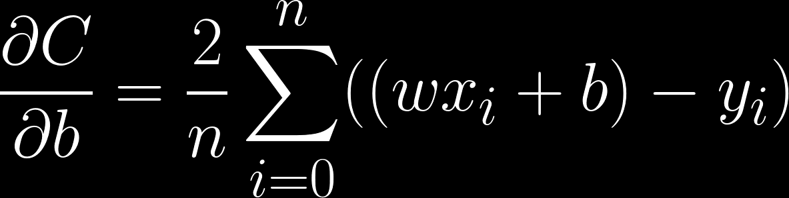
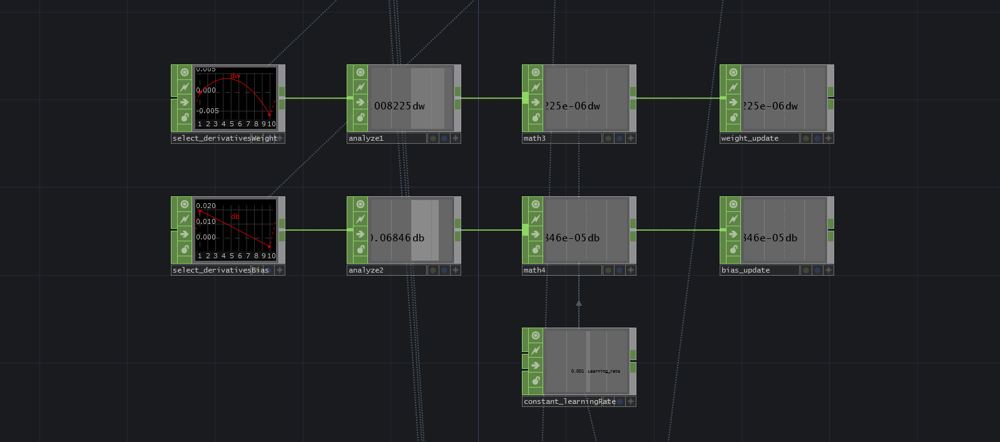
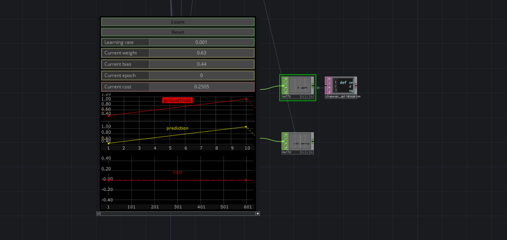

The process of calculating the cost of a certain model is called "**Forward Propagation**". 

Below we have encapsulated the MSE cost function in its node node to keep things readable and tidy. 

We now know that we need to calculate the derivative of the cost function.  As it turns out, in our complete model we will need not only that, but also to find the partial derivatives of every operation in the forward propagation stage. 

We have not seen how to do that yet, but luckily for us we can use a neat calculus trick called the 'chain rule', to compute all derivatives without much hustle. 

The chain rule gives us an easy way to find the derivatives of complex nested functions. It consists of de-composing a complex expression into smaller components and multiplying their respective partial derivatives, in chain.

If we take the partial derivatives of this cost function with respect to it's internal parameters (`w` and `b`), we will get the following equations:

Note: for a detailed information about calculus rules, see 'Appendix 1: Calculus'

This equation tells us the partial derivative of the MSE cost function with respect to the weights `w`. In other words, it tells us in what direction the output of our cost will change, if we alter `w` a little bit.

* ``dC / dw`` : Derivative of cost function 'C' with respect to `w`
* ``2 / n*sum`` : Average of ``n`` samples, multiplied by 2, since the deriative of ``x^2 = 2x``
* ``(wx+b) - y`` : Difference between prediction and ground truth
* ``x`` :  Multiplying with `x` due to chain rule (see cheat-sheet and 'Appendix 1: Calculus'),

This equation tells us the partial derivative of the MSE cost function with respect to the bias `b`. It is not much different that the one for `w`. 

When applying the chain rule, instead of multiplying by `x`, we multiply by 1 (see cheat-sheet and Appendix 1),

* ``dC/db`` : Derivative of cost function 'C' with respect to the bias `b`
* ``2/n * sum`` : Average of `n` samples, multiplied by 2, since the deriative of ``x^2 = 2x``
* ``(wx+b)-y`` : Difference between prediction and ground truth. 

Let us convert these equations into CHOPs to get a good grip of what is happening.

To stream-line things in our network, instead of summing samples right away as in the equation, we will work with each sample separately and we will perform the sum at the end of the process, when we update our  `w` and `b` parameters. 

Since we are dealing with various samples `N` instead of 1 derivative, we call this set of derivatives a '**gradient**'. 

The above network calculates the derivative of the cost function with respect to our prediction `y` (the output of ``wx+b``).

The derivative of prediction with respect to `w` is `x`. This is why we can simply multiply this gradient with `x`.

To find the derivative of the cost with respect to bias `b`, we need to multiply with 1, instead of `x`.

We now can use the calculated derivatives to update the initial parameters. 

Remember that according to our partial derivative equations, we still need to sum and take the average of all the derivatives to come up with a value that we can use to perform the update. We do that in this step using the analyze and math CHOPs.

We can use the final value we get to change our initial weight and bias values in the right direction. This process of updating weight and bias over time is called "**optimization**". 

You can see that we use a factor to scale the value. This factor is called 'learning rate' and determines how big the jump in a given direction is. This is typically a small number, because we do not want to have the risk of jumping too far from the optimal position.

See 'Chapter 07: Optimization' for a more detailed explanation on this.

This stage we just implemented, of calculating the partial derivatives and finally updating the internal parameters (`w` and `b`) of the model, is called "**Back propagation**"

When the entire input samples or  'data set' has been processed (forward and backward), we say that an '**epoch**' has passed. 

In our case, the 'data set' has a single value that gets processed on every run, so every iteration in this network is an "epoch".

If we iterate over our equations continuously, the optimization process will occur automatically. It will be updating the weight and bias slightly in the right direction, on every iteration.

This complete process, spanning typically over several epochs, is called 'learning'. Our algorithm is finding optimal weight and bias values to solve for our ground truth, by itself. 

Click on "**Learn**" to begin the process and observe how our cost function and our prediction changes, eventually finding weight and bias values, with zero cost. 

Click "**Reset**" to go back to the original state.

Afterwards, try changing the learning rate and see how that affects the learning process.

See the node "chopexec_optimization", where we update the original weight and bias parameters, by subtracting the weight and bias derivatives from their corresponding nodes. 

You do not need to look at all inside the UI component here. All it is doing is creating some buttons and visualizers so you can control what we just created. 

