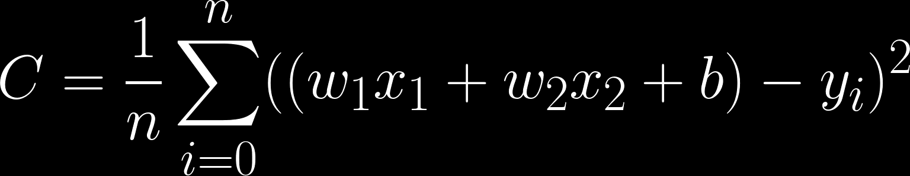
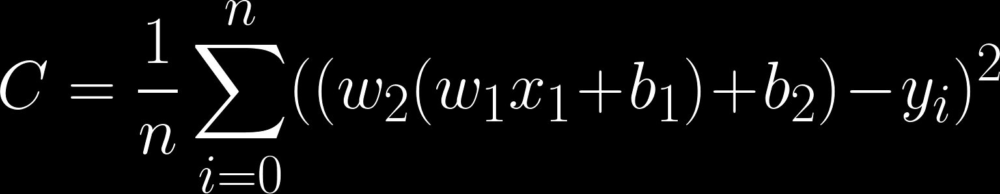
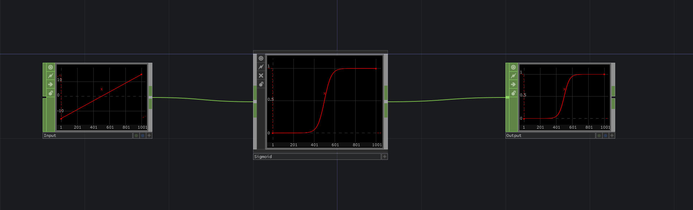
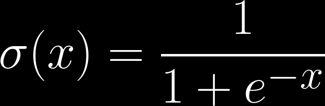

In the previous chapters we showed a simple linear regression network with **10 samples** and **1 input feature** per sample. 

An **input feature** is some value that forms part of the description of a sample. If we would like to have as inputs to our model 10 coordinates in a 2D plane, we would still have 10 samples, but since those coordinates are represented with a vector of size 2 (x, y coordinates), then each of those values is a feature. We would say then that we have **10 samples** and **2 input features** per sample.

When we use multiple input features per sample the process is nearly the same, although with one important distinction. Instead of regular multiplication, we perform a **dot product** between 2 vectors.

From that follows that if our input sample has 2 features, we would need to have 2 weight values. Each weight accounts for each input feature. The cost equation for such case would look like this:

See 'Appendix 2: Linear regression' for a working CHOP example.

In addition, It is also possible to make a more complex function by chaining multiple linear layers. The output of the first linear layer ``wx + b`` will be used as input for the next.

We would need to do this because not all problems can be solved with a single linear equation. In **deep learning** such cases are treated by introducing some non-linearity using special functions called 'activation layers'.

A **sigmoid function** is an example for such an activation layer and its defined as follows:

To understand what this function does, we can analyze the CHOP network below. You can see that it is compressing the input values to the 0 and 1 range, by approaching 1 when the input is closer to positive infinity, and 0 when the input is closer to negative infinity. 

If we need to have our output as representation of some probability we can use the sigmoid function for instance, since its output is always in the range of 0 to 1, which is a perfect range for the task. We would then insert this function after our linear layer in the forward propagation pass. See equation below.

This type of network, where we model the probability of a certain input in relation to a ground truth is called **logistic regression**. 

In practice, many linear layers and different activation functions are stacked upon each other to form a neural network. 

When the network has more than 3 layers, we are dealing with a 'deep' neural network. Hence the name **deep learning**. 

So far we have been dealing only with continuous values, meaning that our prediction output could be any real number. For this task, it was useful to employ the Mean Squared Error (MSE) loss.

However, when dealing with discrete values, such as categories or true/false, we need to use a different loss function. 

There are many different loss functions, all with their own properties and advantages in different scenarios. In the next chapter, we will describe them in detail. 

This type of network, where we model the probability of a certain input in relation to a ground truth is called **logistic regression**. 

In practice, many linear layers and different activation functions are stacked upon each other to form a neural network. 

When the network has more than 3 layers, we are dealing with a 'deep' neural network. Hence the name **deep learning**. 

