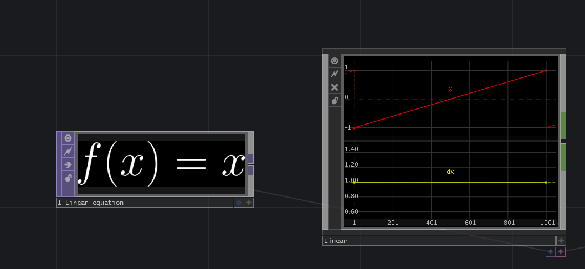
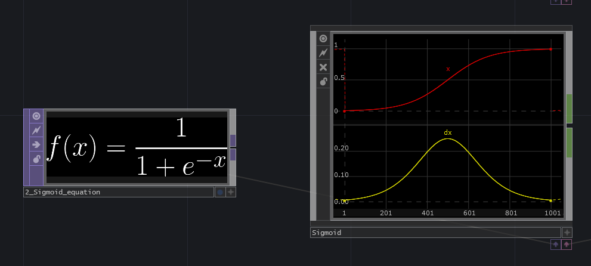
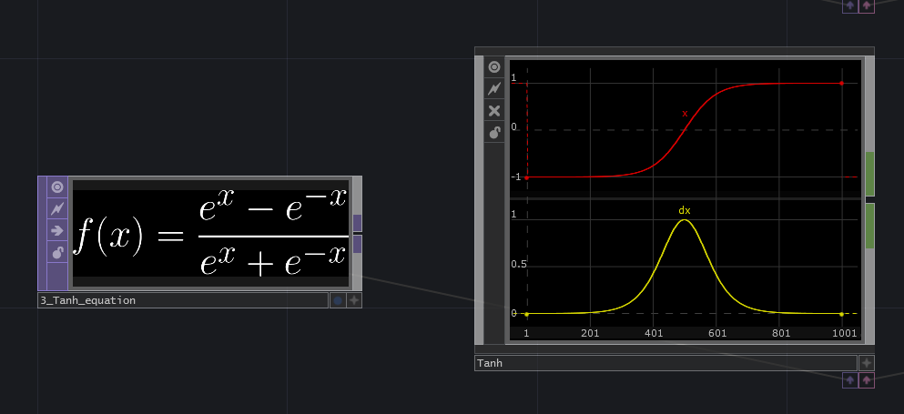
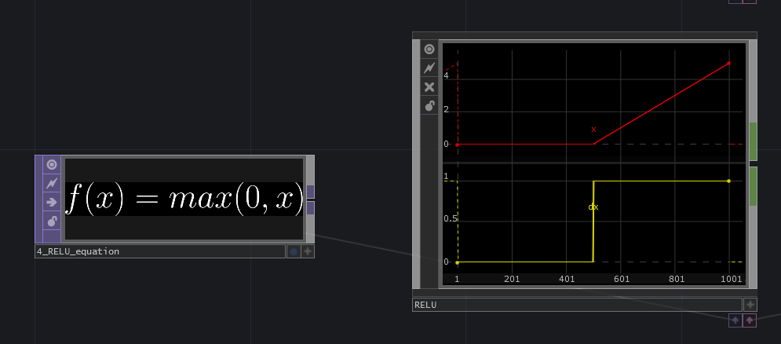
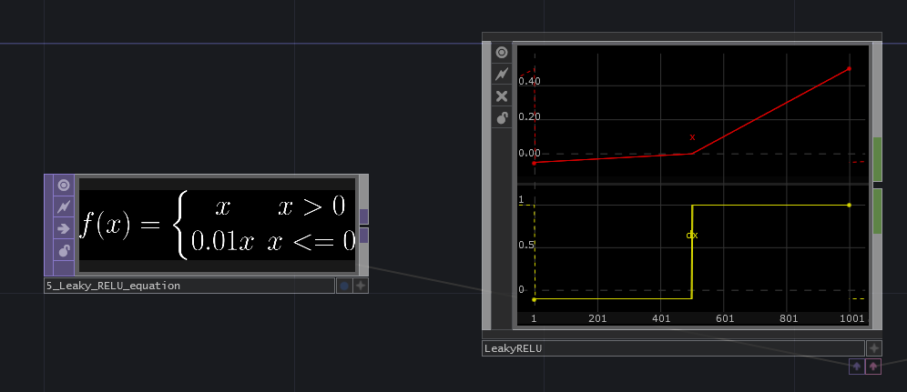
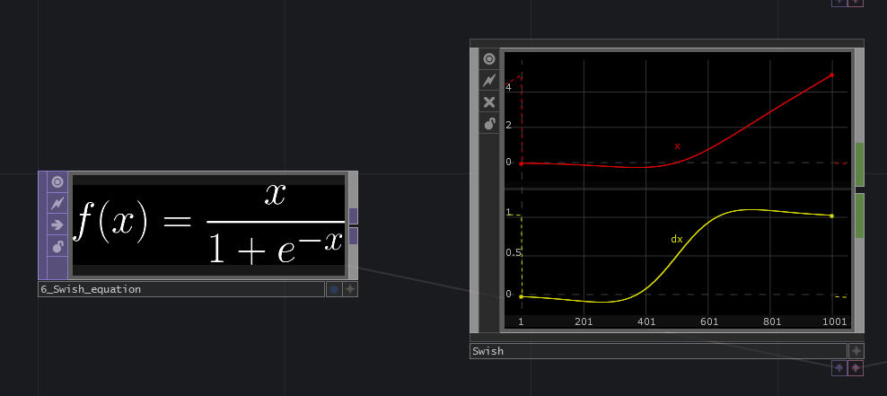
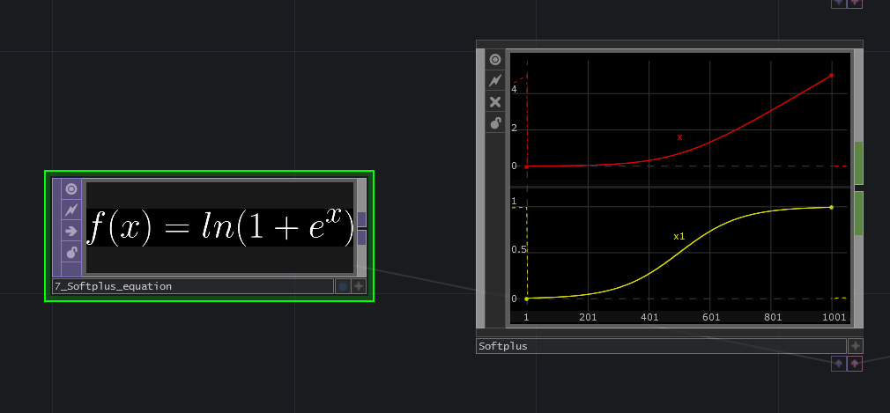

### Linear activation
---
- **Name**: Linear
- **Reach**: -inf to inf 
- **Gradient**: always 1

In general, after a linear layer, always some other non-linear kind of activation function is used instead of the linear one. 

**Disadvantages**: 

- With this function you can only learn linear problems. To solve non-linearity you need to introduce some non-linear function.

- When using this activation in a neural network, all layers will collapse into 1, because every subsequent layer will be a linear function of the previous one, no matter how many layers. In effect, a network with this activation function is simply a linear-regression model.

### Sigmoid activation
---
- **Name**: Sigmoid
- **Reach**: 0 to 1
- **Gradient**: saturating in positive and negative

The sigmoid activation function is the veteran non-linearity function. It squashes the input to a value between 0 and 1, while keeping the magnitude order. This means that the input gets proportionately squashed. 

**Advantage**: Very useful to compute outputs that represent probabilities. Typically used as last later in classification problems.

**Disadvantage**: The gradient saturates when the input is either very large or very small. This results in very small weight updates, making learning sub-optimal. 

### Tanh activation
---
- **Name**: Hyberbolic tangent
- **Reach**: -1 to 1
- **Gradient**: saturating in positive and negative

The Tanh activation function is very similar to the sigmoid, with the difference that it squashes the input into a value between -1 and 1. 

- **Advantage**: It can be useful when negative numbers are needed.

- **Disadvantage**: Like the sigmoid, the gradient is saturating when the input is either very large or very small. This results in very small weight updates, which makes learning sub-optimal.

### RELU activation
---
- **Name**: REctified Linear Unit
- **Reach**: 0 to inf
- **Gradient**: saturating in negative

The RELU activation function is one of the most common activation nowadays. It acts as a linear activation in the positive range, and cancels out (multiplies with 0) when the input is negative.

- **Advantage**: When the input is positive, the gradient flows perfectly, since it gets multiplied by 1.
 
- **Disadvantage**: When the input is negative, it can happen that certain neurons never get triggered, because it gets multiplied by zero. These useless neurons are called 'dead-RELUs'. 

### Leaky-RELU activation
---
- **Name**: Leaky REctified Linear Unit
- **Reach**: -inf to inf
- **Gradient**: slightly saturating in negative

The leaky RELU activation function is an extension of RELU. It tries to solve the saturating gradient by multiplying values below zero with a small 'leakyness' value (0.01). 

 - **Advantage**: Can prevent neurons from dying, since its leakyness causes the gradient not to be completely 0, but slightly negative when the input is below 0.
 
 

### Swish activation
---
- **Name**: Swish activation
- **Reach**: 0 to inf
- **Gradient**: saturating in negative

The swish activation function works similarly to RELU, but is a smooth, non-monotonic function. See the difference of the derivative, compared to the discrete one of RELU.

- **Advantage**: Consistently matches or outperforms ReLU in various machine learning tasks. The math is very simple as it consists on multiplying the input with the sigmoid function.

### Softplus activation
---
- **Name**: Softplus activation
- **Reach**: 0 to inf
- **Gradient**: saturating in negative

The softplus activation function is similar to RELU. It has is a continuous gradient, although has a softer activation near 0.

- **Advantage**: Smoother and differentiable when close to zero.

- **Disadvantage**: Less efficient to compute than RELU, because of log() and exp() in its formulation.

