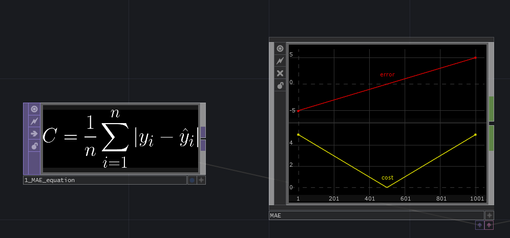

### Mean Absolute Error (MAE) 
---
- **Aliases**: L1 loss 
- **Type**: Regression

Takes the absolute value of the difference between the prediction and ground truth. 

**Advantage**: 
- Robust for outlier values. If our data is corrupted with extreme values, MAE will be relatively stable.

**Disadvantages**: 
- Same error magnitude for big mistakes in relation to very small mistakes.
- Gradient will be large even for small loss values.

### Mean Squared Error (MSE) 
---
- **Aliases**: Quadratic Loss, L2 loss
- **Type**: Regression

Takes the squared difference between the prediction and ground truth. 

**Advantage**: 
- By squaring the error, outlier values get exacerbated, meaning that big mistakes will be greatly penalized.

**Disadvantages**: 
- This exacerbation however makes the function less stable when there are many outliers, which results in less stability 
in the model.

### HUBER 
---
- **Aliases**: Smooth mean absolute error
- **Type**: Regression

Takes the absolute value and the squared difference between the prediction and ground truth over some delta.

**Advantage**: 
- Less sensitive to outliers than MSE and differentiable at zero. Behaves like an absolute error function but with the advantage
that it becomes quadratic when error is small. How small this value is can be determined with a variable `d` (delta)

**Disadvantages**: 
- Highly dependable on delta for proper training, which is a hyperparameter that will also need to be learned for optimal results.

### Cross Entropy 
---
- **Aliases**: Log likelihood
- **Type**: Classification

Used for classification problems where the output of the model is a discrete value. The loss function expects input features 
summed up to one since it models a probability distribution.

**Advantage**: 
- Allows to determine probability for a class. 
- Easily scalable to many input features using a "softmax" function.

