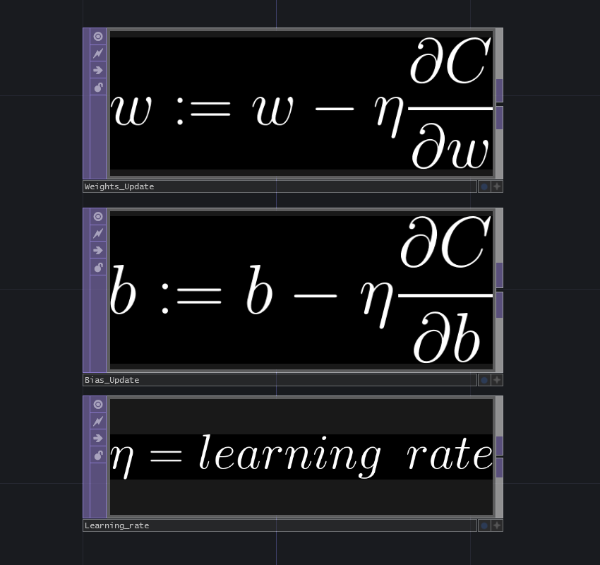

We saw that updating our given weight and bias parameters, so that or model gets automatically improved, is called **optimization**.

There are different ways to optimize a cost function. In most cases, we want to minimize the function by adjusting some given weight and bias values over time. The adjustment values, based on the partial derivatives, are multiplied by a **learning rate**, in order to control how big the jumps in these changes are. The resulting value is finally subtracted from the current weight / bias, so we can move these in the right direction.

This method is called **Stochastic Gradient Descent (SGD)**. "Stochastic", because on each iteration we are training an a random subset of input data, not the whole possible set. "Gradient", because we are using the collection of all partial derivatives in the chain. "Descent", because we are truly descending over the computed gradient to update the internal parameters.

Our equations for optimization look like this:

The learning rate is a so-called "**Hyper parameter**", which needs to be set by the programmer. It is not always obvious what value yields the best results, since setting it too high can cause jumping over the optimal state, while setting it too low makes the model learn very slowly and can take a long while until the model converges. The choice of learning-rate therefore depends highly on the model type and the input data it will be training on.

To understand how gradient descent looks like, we can visualize the "**loss landscape**". This is the multi-dimensional space where our problem lives in. Take a look at "Appendix 03: Gradient descent", where we offer a 3D interactive visualization.

There are various methods of updating the internal weight and bias parameters. For instance, **"SGD with momentum"**, "**RMSProp" (Root mean squared propagation)** or **Adam (adaptive moment estimation)** which are extensions of this principle. 

- **SGD with momentum**: Updates a velocity vector and uses it to update the parameters (see this in action in "Appendix 03: Gradient descent")
 
- **RMSProp**: Uses the moving average of the gradients to update the parameters.

- **Adam**: The combination of previous ones and most widely used method nowadays.

